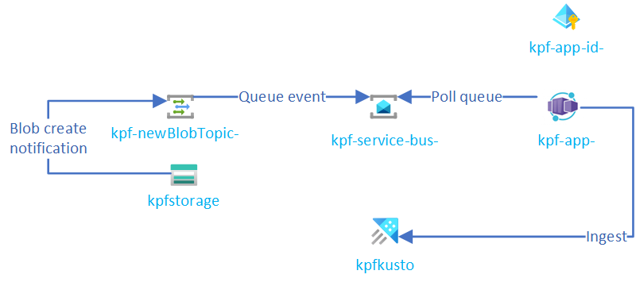

#   Kusto Pre-Forge

This repo offers a solution to common Kusto pre-processing scenarios.

The first one we tackle is to split large
blobs into smaller chunks to enable faster ingestion and prevent failure due to time-outs.

## Try it!

It is easy to try with the [following ARM template](samples/complete/):

(Click [here](templates/) to see variations of this template offering different levels of control)

This template deploys the following resources (you will notice each resource has the same suffix which makes the resource name unique):

Resource Name Prefix|Resource Type|Description
-|-|-
kpfstorage|Storage Account|Storage where we can drop big blobs.  A container is created by default:  `test`.
kpf-newBlobTopic-|Event Grid System Topic|Topic notifying of blob creation in the folder `landing` (and sub folders) of the `test` container.  A subscription, `toServiceBus`, pushes those notification to the service bus queue.
kpf-service-bus-|Service Bus Namespace|Namespace with one queue, `blob-notification`, receiving Event Grid notifications.
kpf-app-env-|Container Apps Environment|Environment with one app.
kpf-app-|Container App|Application pointing to the container image `https://kustopreforge.azurecr.io/kusto-pre-forge/dev`.  The container monitors the service bus queue for notification and process blobs by splitting them into smaller blobs which it sends to the Kusto Cluster.
kpfkusto|Azure Data Explorer Cluster|Kusto cluster ingesting the blobs in pieces.
kpf-app-id-|User Managed Identity|Identity used by the container to access the service bus queue, the storage account and the Kusto cluster.  You can notice the identity has permissions on those resources.

You can test the solution by copying a big blob to the storage account's `landing` container.  You should see (TODO) 

## Contributing

This project has adopted the [Microsoft Open Source Code of Conduct](https://opensource.microsoft.com/codeofconduct/).
For more information see the [Code of Conduct FAQ](https://opensource.microsoft.com/codeofconduct/faq/) or
contact [opencode@microsoft.com](mailto:opencode@microsoft.com) with any additional questions or comments.

## Trademarks

This project may contain trademarks or logos for projects, products, or services. Authorized use of Microsoft 
trademarks or logos is subject to and must follow 
[Microsoft's Trademark & Brand Guidelines](https://www.microsoft.com/en-us/legal/intellectualproperty/trademarks/usage/general).
Use of Microsoft trademarks or logos in modified versions of this project must not cause confusion or imply Microsoft sponsorship.
Any use of third-party trademarks or logos are subject to those third-party's policies.
